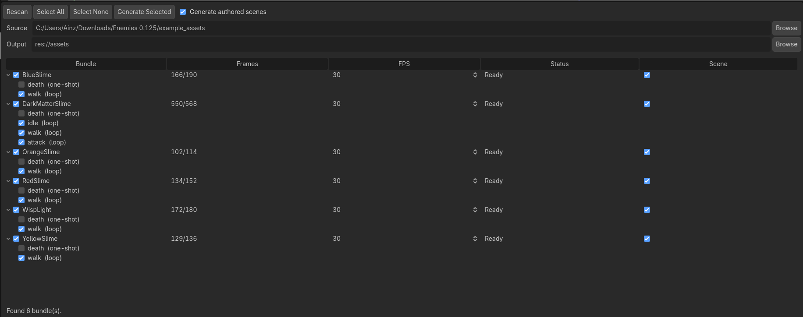

# Godot Spine Atlas Parser

A Godot 4 editor addon that turns a Spine **packed** export (atlas pages plus
its `.atlas` sidecar) into ready-to-use `SpriteFrames` bundles, with per-frame
anchoring taken from Spine's pivot data. It is a lightweight
`AnimatedSprite2D`-based alternative to a full Spine runtime for simple or
trash-mob enemies, where skeletal playback is more than the art needs.

## Features

- De-packs the Spine atlas and re-packs every frame into one controlled,
  engine-friendly texture page (a second page is only added past the max
  texture size).
- Preserves Spine's identical-frame deduplication, so multi-state enemies stay
  small.
- Anchors each frame on Spine's `origin` pivot, resolved per animation, so the
  sprite stays correctly placed without hand-tuning offsets.
- Driven from an editor dock: pick folders, scan, configure, generate.
- Auto-detects loop vs one-shot per animation from its name (`death`, `hit`,
  `spawn` default to one-shot, everything else loops), with a per-animation
  override in the dock.
- Optionally emits a ready-to-instance `<bundle>.tscn` next to each bundle.
- Supports both straight-alpha and premultiplied-alpha (PMA) exports.
- Outputs binary `.res` bundles for fast cold loads on web and mobile.

## Requirements

- Godot 4.4 or newer.
- A Spine **packed** (atlas) export: one or more page images plus the matching
  `.atlas` sidecar.

## Required Spine export settings

- **Pack: ON.** The addon consumes the packed atlas export, not loose per-frame
  PNGs.
- **Rotation: OFF.** Rotated atlas regions are rejected; the addon re-packs the
  frames itself and does not read rotated source regions.
- **Premultiply alpha: either.** Both straight-alpha and PMA exports are
  supported. Straight alpha is the simplest path; PMA is handled via a
  premultiplied-alpha blend material (see below).
- **Bleed: recommended** on the Spine side to avoid edge artifacts.
- **Frame naming:** `state_<N>-<animation>` (for example `state_0-walk`). The
  `state_<N>-` prefix is optional and defaults to state `0`.

## Installation

1. Download or clone this repository.
2. Copy `addons/spine_atlas_parser/` into your project's `addons/` folder.
3. Enable the plugin in Project Settings > Plugins.

## Usage

With the plugin enabled, open the **Spine Atlas Parser** dock:

1. Pick the **source** folder (the Spine packed export) and the **output**
   folder (inside your project).
2. **Scan** to list the bundles found in the export.
3. Per bundle, set the **FPS** and whether to also emit an authored **scene**.
   Loop vs one-shot is auto-detected per animation from its name (`death`, `hit`,
   `spawn` default to one-shot, all others loop); flip any animation's flag with
   its checkbox.
4. **Generate Selected** to produce a `<bundle>.res` (and, if enabled, a
   `<bundle>.tscn`) in the output folder.

The "Generate authored scenes" toggle flips every row at once; the per-bundle
"Scene" column overrides individual bundles. Turn it off when you wire bundles
into your own nodes and do not want the extra scene files.

## Using a generated bundle

Two ways to use the output:

- **Instance the generated scene.** Drop the `<bundle>.tscn` into your scene. Its
  root is a `PackedAnimatedSprite2D` already referencing the bundle (and, for a
  PMA bundle, already carrying the premult material).
- **Build your own node.** Add a `PackedAnimatedSprite2D` and assign the
  `<bundle>.res` to its `sprite_frames`. Play animations by name, for example
  `play("state_0-walk")`. The node applies the per-animation pivot live.

## Premultiplied alpha

The `.res` bundle records a `pma` flag describing whether the source pixels are
premultiplied. The runtime node does not auto-apply any material, so PMA is your
call:

- If you instance the generated `<bundle>.tscn`, a PMA bundle already has
  `premult_alpha_material.tres` (a `CanvasItemMaterial` with
  `BLEND_MODE_PREMULT_ALPHA`) baked onto its root.
- If you assign the `.res` to your own node, set the node's `material` to
  `res://addons/spine_atlas_parser/runtime/premult_alpha_material.tres` (or your
  own blend) for a PMA bundle.

## License

MIT. See [LICENSE](LICENSE).
